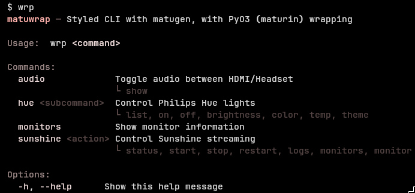
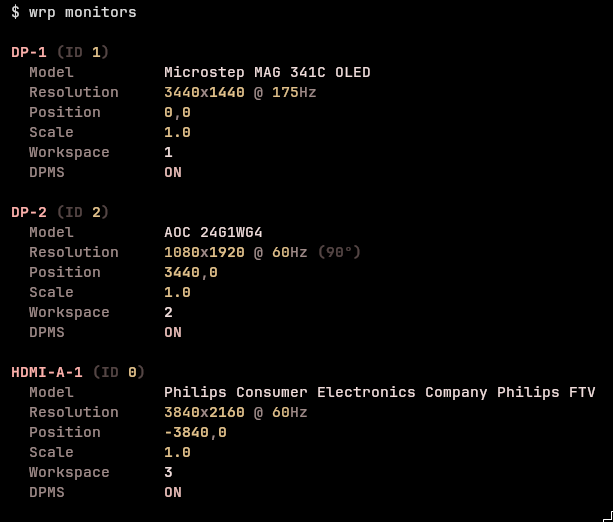

# matuwrap

Hyprland system utilities with matugen-themed output and native Rust acceleration.




## Install

Requires Rust toolchain and [maturin](https://github.com/PyO3/maturin).

```bash
# Sync dependencies
uv sync

# Build and install
uv run maturin build --release
uv tool install .
```

For development:

```bash
# Sync dependencies
uv sync

# Build and run
uv run maturin develop --release   # Build + install to local .venv
uv run wrp monitors                # Run from .venv
```

Alternative: Makefile

| Command              | Description                             |
| -------------------- | --------------------------------------- |
| `make test`          | Run tests with verbose output           |
| `make coverage`      | Run tests + terminal coverage report    |
| `make coverage-html` | Run tests + open html-report in Browser |
| `make build`         | Release build (maturin)                 |
| `make dev`           | Dev build (maturin)                     |
| `make clean`         | Remove build artifacts                  |


## Usage

```bash
wrp
wrp -h                             # Show help

wrp monitors                       # Show monitor info
wrp audio                          # Toggle HDMI/Headset
wrp audio show                     # Show current sinks
wrp sunshine                       # Show status
wrp sunshine start|stop            # Control service
wrp sunshine monitors              # List capture monitors
wrp sunshine monitor DP-1          # Set capture monitor
wrp hue                            # Same as wrp hue list
wrp hue <on/off> <id>              # Turn on light <id>
wrp hue color <id> "<HEX>"         # Set color "<HEX>" for light <id>
wrp hue brightness <id> <percent>  # Set brightness <percent> for light <id>
```

## Performance

Native Rust module (`wrp_native`) provides significant speedups:

| Operation | Before | After | Speedup |
|-----------|--------|-------|---------|
| Matugen colors (cached) | 345ms | 0.02ms | ~15,000x |
| Hyprland IPC | 2.1ms | 0.05ms | ~40x |

- **Color caching**: Matugen results cached to `~/.cache/matuwrap/colors.json` with wallpaper mtime validation
- **Hyprland IPC**: Direct Unix socket communication instead of spawning `hyprctl`

## Adding Commands

Create a file in `src/matuwrap/commands/`:

```python
# src/matuwrap/commands/mycommand.py
"""Short description."""

COMMAND = {
    "description": "What this command does",
    "args": "<arg>",       # optional
    "subcommands": [       # optional
        ("sub", "<arg>", "Subcommand description"),
    ],
}

def run(*args: str) -> int:
    if args and args[0] == "sub":
        return do_sub(args[1])
    return do_default()
```

Auto-discovered. Available immediately as `wrp mycommand`.

## Theme Helpers

Import from `matuwrap.core.theme`:

| Function | Purpose |
|----------|---------|
| `print_header(text)` | Section headers |
| `print_kv(label, value)` | Key-value pairs |
| `print_success/error/warning/info(text)` | Status messages |
| `fmt(value, unit="")` | Type-aware formatting |
| `create_table(*columns)` | Styled tables |
| `console` | Rich console instance |

## Architecture

```
src/matuwrap/
├── assets
│   └── img
├── commands
│   ├── audio.py
│   ├── hue.py
│   ├── __init__.py
│   ├── monitors.py
│   └── sunshine.py
├── core
│   ├── colors.py
│   ├── hyprland.py
│   ├── __init__.py
│   ├── notify.py
│   ├── systemd.py
│   └── theme.py
├── cli.py
├── __init__.py
├── py.typed
└── wrp_native.pyi

rust/
├── src
│   └── lib.rs  # PyO3 native module
├── Cargo.lock
└── Cargo.toml 
```
